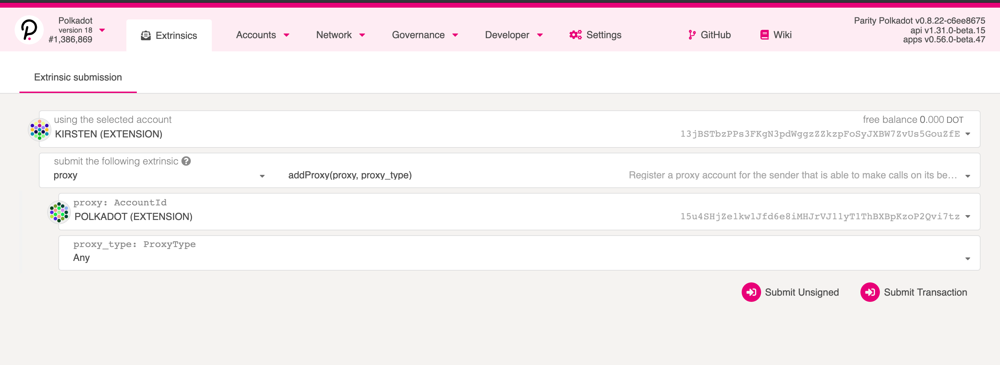

Polkadot provides a module that allows users to set proxy accounts to perform a limited number of
actions on their behalf. Much like the Stash and Controller account relationship in
[staking](learn-staking), proxies allow users to keep one account in cold storage and actively
participate in the network with the weight of the tokens in that account.

## Proxy Types

You can set a proxy account via the Proxy module. When you set a proxy, you must choose a type of
proxy for the relationship. Polkadot offers:

- Any
- Non-transfer
- Staking
- Governance
- Identity Judgement

When a proxy account makes a `proxy` transaction, Polkadot filters the desired transaction to ensure
that the proxy account has the appropriate permission to make that transaction on behalf of the cold
account.

### Any Proxies

As implied by the name, a proxy type of "Any" allows the proxy account to make any transaction,
incuding balance transfers. In most cases, this should be avoided as the proxy account is used more
frequently than the cold account and is therefore less secure. To allow any type of transaction
except balance transfers (including vested transfers), the "Non-transfer" proxy type will be a
better fit.

### Governance Proxies

The "Governance" type will allow proxies to make transactions related to governance (i.e., from the
Democracy, Council, Treasury, Technical Committee, and Elections pallets).

> Head over to our [Governance page](maintain-guides-democracy#governance-proxies) for more
> information on governance proxies.

### Staking Proxies

The "Staking" type allows staking-related transactions, but do not confuse a staking proxy with the
Controller account. Within the Staking pallet, some transactions must come from the Stash, while
others must come from the Controller. The Stash account is meant to stay in cold storage, while the
Controller account makes day-to-day transactions like setting session keys or deciding which
validators to nominate. The Stash account still needs to make some transactions, though, like
bonding extra funds or designating a new Controller. A proxy doesn't change the _roles_ of Stash and
Controller accounts, but does allow the Stash to be accessed even less frequently.

### Identity Judgement Proxies

"Identity Judgement" proxies are in charge of allowing registars to make judgement on an account's
identity. If you are unfamiliar with judgements and identities on chain, please refer to
[this page](learn-identity#judgements).

### Anonymous Proxies

Polkadot includes a function to create an anonymous proxy, an account that can only be accessed via
proxy. That is, it generates an address but no corresponding private key. Normally, a primary
account designates a proxy account, but anonymous proxies are the opposite. The account that creates
the proxy relationship is the proxy account and the new account is the primary. Use extreme care
with anonymous proxies; once you remove the proxy relationship, the account will be inaccessible.
This type of proxy is very different from the other regular types of proxies, and belongs in its own
category.

## How to set up a Proxy

To set up either a governance, staking, identity judgement, or any proxy, head over to the
[Polkadot-JS UI](https://polkadot.js.org/apps) and in the navigation tab, click on "Developer" >
"Extrinsics". Here we will see a page that looks similar to this:

Now, to add a proxy, we must first click on the selection of pallets, the button will be "submit the
following extrinsic". Select the "proxy" pallet to load in all the functions that come with it. The
`addProxy(proxy, proxy_type)` function will need to be selected in order to add in a proxy. The
chosen proxy account that you set will be the account that has the proxy on it. The selected account
at the top is the account that will be the user primary account or stash account.

For anonymous proxies, a different function will need to be called, the
`anonymous(proxy_type, index)`. This will let you customize what kind of anonymous proxy you'd like
to set up if you choose, as well as the index.

### Removing Proxies

If you want to remove a proxy, there are a few functions on the extrinsic page that will help do
this. The `killAnonymous()` function will let you remove an anonymous proxy. Both the
`removeProxies()` and the `removeProxy()` will remove any other type of proxy but one function will
remove all proxies made while the other will remove one proxy, respectively.

## Putting It All Together

If the idea of proxy types and their application seems abstract, it is. Here is an example of how
you might use these accounts. Imagine you have one account as your primary token-holding account,
and don't want to access it very often, but you do want to participate in governance and staking.
You could set Governance and Staking proxies.

In this example, the primary account A would only make two transactions to set account B as its
governance proxy and account C as its staking proxy. Now, account B could participate in governance
activity on behalf of A.

Likewise, account C could perform actions typically associated with a stash account, like bonding
funds and setting a Controller, in this case account D. Actions that normally require the Stash,
like bonding extra tokens or setting a new Controller, can all be handled by its proxy account C. In
the case that account C is compromised, it doesn't have access to transfer-related transactions, so
the primary account could just set a new proxy to replace it.

By creating multiple accounts that act for a single account, it lets you come up with more granular
security practices around how you protect private keys while still being able to actively
participate in a network.
